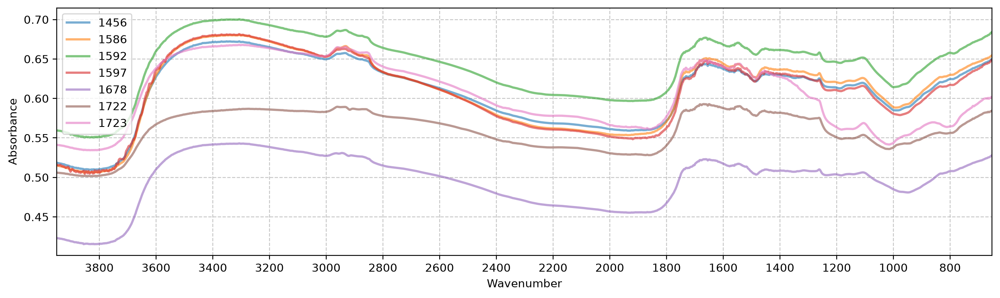
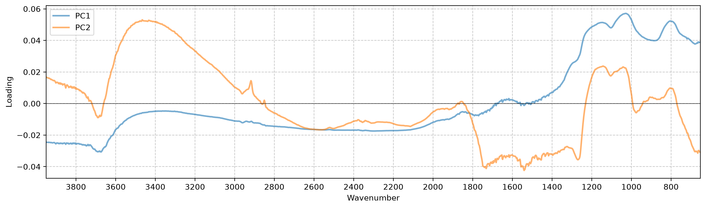
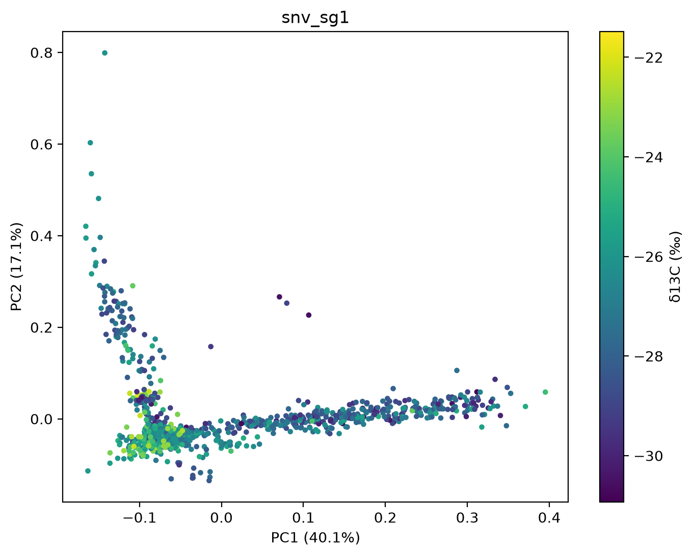
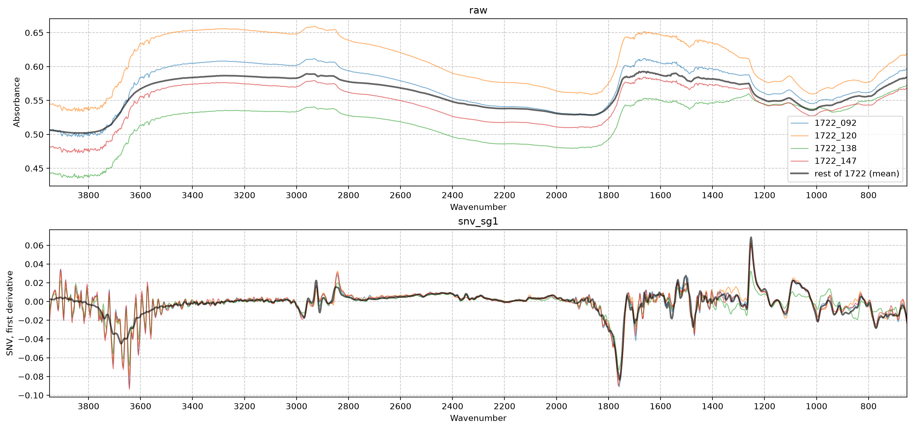

# Exploratory data analysis


<!-- WARNING: THIS FILE WAS AUTOGENERATED! DO NOT EDIT! -->

Each batch is a set of cassava plants grown under its own conditions and
scanned at its own time, on the same spectrometer. This notebook looks
at how much of the δ13C variation and of the spectral variation is
between batches, because that decides how models should be validated and
whether a global model across batches makes sense.

``` python
import numpy as np, pandas as pd, matplotlib.pyplot as plt
from sklearn.decomposition import PCA
from sklearn.pipeline import make_pipeline
from soilspectfm.all import *
from cassava.data import *
```

``` python
d = load_data('../data')
df = pd.DataFrame(dict(c13=d.y, batch=d.batch))
```

## δ13C by batch

``` python
df.groupby('batch').c13.describe().round(2)
```

<div>
<style scoped>
    .dataframe tbody tr th:only-of-type {
        vertical-align: middle;
    }
&#10;    .dataframe tbody tr th {
        vertical-align: top;
    }
&#10;    .dataframe thead th {
        text-align: right;
    }
</style>

<table class="dataframe" data-quarto-postprocess="true" data-border="1">
<thead>
<tr style="text-align: right;">
<th data-quarto-table-cell-role="th"></th>
<th data-quarto-table-cell-role="th">count</th>
<th data-quarto-table-cell-role="th">mean</th>
<th data-quarto-table-cell-role="th">std</th>
<th data-quarto-table-cell-role="th">min</th>
<th data-quarto-table-cell-role="th">25%</th>
<th data-quarto-table-cell-role="th">50%</th>
<th data-quarto-table-cell-role="th">75%</th>
<th data-quarto-table-cell-role="th">max</th>
</tr>
<tr>
<th data-quarto-table-cell-role="th">batch</th>
<th data-quarto-table-cell-role="th"></th>
<th data-quarto-table-cell-role="th"></th>
<th data-quarto-table-cell-role="th"></th>
<th data-quarto-table-cell-role="th"></th>
<th data-quarto-table-cell-role="th"></th>
<th data-quarto-table-cell-role="th"></th>
<th data-quarto-table-cell-role="th"></th>
<th data-quarto-table-cell-role="th"></th>
</tr>
</thead>
<tbody>
<tr>
<td data-quarto-table-cell-role="th">1456</td>
<td>149.0</td>
<td>-23.85</td>
<td>1.20</td>
<td>-26.50</td>
<td>-24.77</td>
<td>-23.80</td>
<td>-22.99</td>
<td>-21.48</td>
</tr>
<tr>
<td data-quarto-table-cell-role="th">1586</td>
<td>168.0</td>
<td>-28.87</td>
<td>1.00</td>
<td>-30.68</td>
<td>-29.63</td>
<td>-28.94</td>
<td>-28.25</td>
<td>-26.12</td>
</tr>
<tr>
<td data-quarto-table-cell-role="th">1592</td>
<td>244.0</td>
<td>-26.06</td>
<td>0.85</td>
<td>-28.72</td>
<td>-26.59</td>
<td>-26.12</td>
<td>-25.49</td>
<td>-23.69</td>
</tr>
<tr>
<td data-quarto-table-cell-role="th">1597</td>
<td>97.0</td>
<td>-28.11</td>
<td>0.78</td>
<td>-30.39</td>
<td>-28.70</td>
<td>-28.16</td>
<td>-27.64</td>
<td>-25.96</td>
</tr>
<tr>
<td data-quarto-table-cell-role="th">1678</td>
<td>144.0</td>
<td>-25.56</td>
<td>1.62</td>
<td>-28.72</td>
<td>-26.73</td>
<td>-25.95</td>
<td>-24.29</td>
<td>-22.26</td>
</tr>
<tr>
<td data-quarto-table-cell-role="th">1722</td>
<td>177.0</td>
<td>-28.54</td>
<td>1.11</td>
<td>-30.93</td>
<td>-29.32</td>
<td>-28.51</td>
<td>-27.75</td>
<td>-26.05</td>
</tr>
<tr>
<td data-quarto-table-cell-role="th">1723</td>
<td>179.0</td>
<td>-27.36</td>
<td>1.26</td>
<td>-30.74</td>
<td>-28.35</td>
<td>-27.37</td>
<td>-26.35</td>
<td>-23.75</td>
</tr>
</tbody>
</table>

</div>

``` python
ax = df.boxplot(column='c13', by='batch', grid=False)
ax.figure.suptitle('')
ax.set(title='', ylabel='δ13C (‰)');
```


The share of the δ13C variance that lies between batches is the sum of
squares of the batch means around the overall mean, divided by the total
sum of squares (η²). A model that only learned which batch a sample came
from would reach an R² of about this value on a random split, so it is
the baseline to compare random-split scores with.

``` python
def eta2(v, groups):
    "Share of the variance of `v` that lies between `groups`"
    v = pd.Series(v)
    m = v.groupby(np.asarray(groups)).transform('mean')
    return ((m - v.mean())**2).sum() / ((v - v.mean())**2).sum()
```

``` python
eta2(d.y, d.batch)
```

    np.float64(0.6766030126145667)

## Spectra by batch

Mean spectrum of each batch:

``` python
fig, ax = plt.subplots(figsize=(15, 4))
for b in np.unique(d.batch): plot_spectra(d.X[d.batch == b].mean(0), d.ws, ascending=False, ax=ax, color=None, label=b, lw=2)
ax.legend();
```



## PCA scores by batch

PCA on the raw spectra, on SNV-corrected spectra, and on the
Savitzky-Golay first derivative of the SNV-corrected spectra. SNV
centres and scales each spectrum on its own, which removes differences
in baseline offset and overall intensity between samples. If the batches
differ mainly in those, they separate less after SNV. The first
derivative also removes any remaining baseline curvature and sharpens
overlapping bands, so what is left is differences in band shape and
position.

``` python
snv_sg1 = make_pipeline(SNV(), SavitzkyGolay(deriv=1))
Xs = dict(raw=d.X, snv=SNV().fit_transform(d.X), snv_sg1=snv_sg1.fit_transform(d.X))
pcas = {k: PCA(n_components=2).fit(X) for k, X in Xs.items()}
scores = {k: pcas[k].transform(X) for k, X in Xs.items()}
```

``` python
fig, axs = plt.subplots(1, len(scores), figsize=(5*len(scores), 4.5), layout='constrained')
for ax, (k, s) in zip(axs, scores.items()):
    for b in np.unique(d.batch): ax.scatter(*s[d.batch == b].T, s=8, alpha=0.6, label=b)
    r = pcas[k].explained_variance_ratio_
    ax.set(title=k, xlabel=f'PC1 ({r[0]:.1%})', ylabel=f'PC2 ({r[1]:.1%})')
axs[-1].legend(title='batch');
```


The between-batch share (η²) of each score measures how strongly the
batches separate along that component:

``` python
pd.DataFrame({k: [eta2(s[:, i], d.batch) for i in (0, 1)] for k, s in scores.items()}, index=['PC1', 'PC2']).round(2)
```

<div>
<style scoped>
    .dataframe tbody tr th:only-of-type {
        vertical-align: middle;
    }
&#10;    .dataframe tbody tr th {
        vertical-align: top;
    }
&#10;    .dataframe thead th {
        text-align: right;
    }
</style>

<table class="dataframe" data-quarto-postprocess="true" data-border="1">
<thead>
<tr style="text-align: right;">
<th data-quarto-table-cell-role="th"></th>
<th data-quarto-table-cell-role="th">raw</th>
<th data-quarto-table-cell-role="th">snv</th>
<th data-quarto-table-cell-role="th">snv_sg1</th>
</tr>
</thead>
<tbody>
<tr>
<td data-quarto-table-cell-role="th">PC1</td>
<td>0.49</td>
<td>0.29</td>
<td>0.80</td>
</tr>
<tr>
<td data-quarto-table-cell-role="th">PC2</td>
<td>0.37</td>
<td>0.63</td>
<td>0.25</td>
</tr>
</tbody>
</table>

</div>

The loadings of the SNV PCA show which wavenumbers drive each component:

``` python
fig, ax = plt.subplots(figsize=(15, 4))
for i, l in enumerate(pcas['snv'].components_): plot_spectra(l, d.ws, ascending=False, ax=ax, ylabel='Loading', color=None, label=f'PC{i+1}', lw=2)
ax.axhline(0, color='k', lw=0.5)
ax.legend();
```



The `snv_sg1` scores coloured by δ13C show whether the two arms follow
δ13C:

``` python
fig, ax = plt.subplots(figsize=(8, 6))
sc = ax.scatter(*scores['snv_sg1'].T, c=d.y, s=8, cmap='viridis')
r = pcas['snv_sg1'].explained_variance_ratio_
ax.set(title='snv_sg1', xlabel=f'PC1 ({r[0]:.1%})', ylabel=f'PC2 ({r[1]:.1%})')
fig.colorbar(sc, label='δ13C (‰)');
```



## Isolated samples

Four samples sit apart from both arms and the core of the `snv_sg1`
scores, at PC1 \> -0.05 and PC2 \> 0.12:

``` python
s = scores['snv_sg1']
odd = (s[:, 0] > -0.05) & (s[:, 1] > 0.12)
pd.DataFrame(dict(id=d.ids[odd], batch=d.batch[odd], c13=d.y[odd], pc1=s[odd, 0], pc2=s[odd, 1])).round(3)
```

<div>
<style scoped>
    .dataframe tbody tr th:only-of-type {
        vertical-align: middle;
    }
&#10;    .dataframe tbody tr th {
        vertical-align: top;
    }
&#10;    .dataframe thead th {
        text-align: right;
    }
</style>

<table class="dataframe" data-quarto-postprocess="true" data-border="1">
<thead>
<tr style="text-align: right;">
<th data-quarto-table-cell-role="th"></th>
<th data-quarto-table-cell-role="th">id</th>
<th data-quarto-table-cell-role="th">batch</th>
<th data-quarto-table-cell-role="th">c13</th>
<th data-quarto-table-cell-role="th">pc1</th>
<th data-quarto-table-cell-role="th">pc2</th>
</tr>
</thead>
<tbody>
<tr>
<td data-quarto-table-cell-role="th">0</td>
<td>1722_092</td>
<td>1722</td>
<td>-29.017</td>
<td>0.080</td>
<td>0.253</td>
</tr>
<tr>
<td data-quarto-table-cell-role="th">1</td>
<td>1722_120</td>
<td>1722</td>
<td>-30.594</td>
<td>0.107</td>
<td>0.227</td>
</tr>
<tr>
<td data-quarto-table-cell-role="th">2</td>
<td>1722_138</td>
<td>1722</td>
<td>-29.358</td>
<td>-0.013</td>
<td>0.158</td>
</tr>
<tr>
<td data-quarto-table-cell-role="th">3</td>
<td>1722_147</td>
<td>1722</td>
<td>-30.548</td>
<td>0.071</td>
<td>0.266</td>
</tr>
</tbody>
</table>

</div>

All four come from batch 1722. Their spectra, against the mean spectrum
of the rest of batch 1722:

``` python
rest = (d.batch == '1722') & ~odd
fig, axs = plt.subplots(2, 1, figsize=(15, 7), layout='constrained')
for ax, k, yl in zip(axs, ('raw', 'snv_sg1'), ('Absorbance', 'SNV, first derivative')):
    for i in np.flatnonzero(odd): plot_spectra(Xs[k][i], d.ws, ascending=False, ax=ax, title=k, ylabel=yl, color=None, label=d.ids[i])
    plot_spectra(Xs[k][rest].mean(0), d.ws, ascending=False, ax=ax, title=k, ylabel=yl, color='k', lw=2, label='rest of 1722 (mean)')
axs[0].legend();
```



## Water vapour

Water vapour in the beam adds sharp, regular lines to a spectrum,
strongest between about 3900 and 3550 cm⁻¹. `vapour_index` measures them
as the spread of the narrow features in that window: the residual of
each SNV spectrum after Savitzky-Golay smoothing, which keeps the narrow
vapour lines and removes the broad edge of the leaf O-H band. Random
noise also raises the index, so it flags candidates rather than proving
vapour.

``` python
def vapour_index(
    X, # SNV-corrected spectra, one per row
    ws, # Wavenumbers (cm⁻¹)
    lo=3550, # Lower edge of the window (cm⁻¹)
    hi=3900, # Upper edge of the window (cm⁻¹)
    window_length=11, # Savitzky-Golay smoothing window, in points
):
    "Spread of the narrow features of each spectrum between `lo` and `hi`"
    hp = X - SavitzkyGolay(window_length=window_length).fit_transform(X)
    return hp[:, (ws >= lo) & (ws <= hi)].std(1)
```

``` python
vi = vapour_index(Xs['snv'], d.ws)
ax = pd.DataFrame(dict(vi=vi, batch=d.batch)).boxplot(column='vi', by='batch', grid=False)
ax.figure.suptitle('')
ax.set(title='', ylabel='Water vapour index', yscale='log');
```


The index follows PC2 of the `snv_sg1` scores closely, so the vertical
arm in the PCA plot is water vapour:

``` python
np.corrcoef(vi, scores['snv_sg1'][:, 1])[0, 1]
```

    np.float64(0.9158113813141444)

Samples per batch with an index above three times the overall median, an
arbitrary threshold to show the extent:

``` python
pd.Series(vi > 3*np.median(vi)).groupby(d.batch).agg(['sum', 'mean']).round(2)
```

<div>
<style scoped>
    .dataframe tbody tr th:only-of-type {
        vertical-align: middle;
    }
&#10;    .dataframe tbody tr th {
        vertical-align: top;
    }
&#10;    .dataframe thead th {
        text-align: right;
    }
</style>

<table class="dataframe" data-quarto-postprocess="true" data-border="1">
<thead>
<tr style="text-align: right;">
<th data-quarto-table-cell-role="th"></th>
<th data-quarto-table-cell-role="th">sum</th>
<th data-quarto-table-cell-role="th">mean</th>
</tr>
</thead>
<tbody>
<tr>
<td data-quarto-table-cell-role="th">1456</td>
<td>0</td>
<td>0.00</td>
</tr>
<tr>
<td data-quarto-table-cell-role="th">1586</td>
<td>0</td>
<td>0.00</td>
</tr>
<tr>
<td data-quarto-table-cell-role="th">1592</td>
<td>27</td>
<td>0.11</td>
</tr>
<tr>
<td data-quarto-table-cell-role="th">1597</td>
<td>57</td>
<td>0.59</td>
</tr>
<tr>
<td data-quarto-table-cell-role="th">1678</td>
<td>4</td>
<td>0.03</td>
</tr>
<tr>
<td data-quarto-table-cell-role="th">1722</td>
<td>6</td>
<td>0.03</td>
</tr>
<tr>
<td data-quarto-table-cell-role="th">1723</td>
<td>2</td>
<td>0.01</td>
</tr>
</tbody>
</table>

</div>
