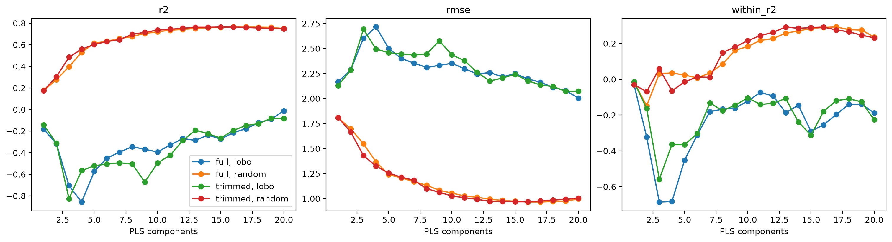
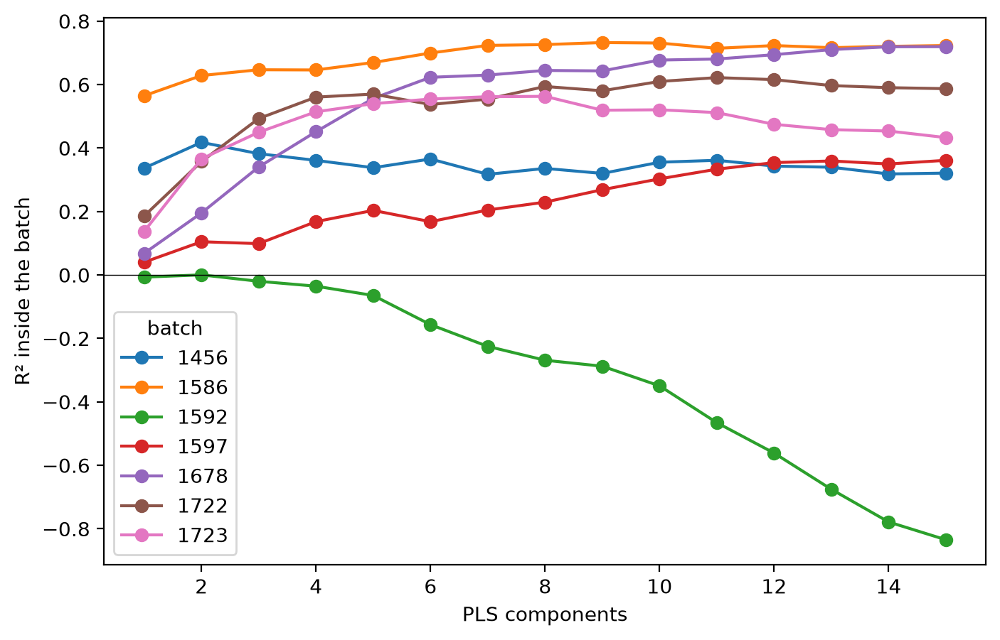

# PLS baseline


<!-- WARNING: THIS FILE WAS AUTOGENERATED! DO NOT EDIT! -->

This notebook fits a PLS regression baseline and scores it in three
ways. A random split stratified by batch tests predictions for new
samples from batches the model has seen. Leave-one-batch-out tests
predictions for a batch the model has never seen. The within-batch R²
measures how well the model ranks samples inside each batch.

Batch alone explains 68% of the δ13C variance (see the EDA notebook). A
random-split R² near 0.68 therefore shows no skill beyond recognising
the batch.

``` python
import numpy as np, pandas as pd, matplotlib.pyplot as plt
from sklearn.cross_decomposition import PLSRegression
from sklearn.metrics import r2_score, root_mean_squared_error
from sklearn.model_selection import StratifiedKFold, KFold, LeaveOneGroupOut, cross_val_predict
from sklearn.pipeline import make_pipeline
from soilspectfm.all import *
from fastcore.test import *
from cassava.data import *
```

``` python
d = load_data('../data')
```

## Metrics

``` python
def within_r2(
    y, # Observed values
    yhat, # Predicted values
    groups, # Group of each sample
):
    "R² of `yhat` against `y` after centring both on their group means"
    yc, pc = (pd.Series(v).groupby(np.asarray(groups)).transform(lambda s: s - s.mean()) for v in (y, yhat))
    return 1 - ((yc - pc)**2).sum() / (yc**2).sum()
```

A model that predicts only the batch means scores a high R² and a
within-batch R² of 0:

``` python
y, g = np.array([1., 2, 5, 6]), np.array(['a', 'a', 'b', 'b'])
means = np.array([1.5, 1.5, 5.5, 5.5])
test_eq(within_r2(y, means, g), 0)
r2_score(y, means)
```

    0.9411764705882353

``` python
def metrics(
    y, # Observed values
    yhat, # Predicted values
    groups, # Group of each sample
) -> dict:
    "R², RMSE and within-group R² of `yhat` against `y`"
    return dict(r2=r2_score(y, yhat), rmse=root_mean_squared_error(y, yhat), within_r2=within_r2(y, yhat, groups))
```

``` python
def per_batch(
    y, # Observed values
    yhat, # Predicted values
    groups, # Group of each sample
) -> pd.DataFrame:
    "Sample count, RMSE, bias, R², within-group R² and correlation of `yhat` against `y` in each group"
    rows = {}
    for b in np.unique(groups):
        m = groups == b
        yb, pb = y[m], yhat[m]
        fit = dict(r2=r2_score(yb, pb), within_r2=within_r2(yb, pb, groups[m]), r=np.corrcoef(yb, pb)[0, 1])
        rows[b] = dict(n=m.sum(), rmse=root_mean_squared_error(yb, pb), bias=(pb - yb).mean(), **fit)
    return pd.DataFrame(rows).T
```

## Model

The pipeline first keeps the wavenumbers up to `w_max`. It then applies
SNV, a Savitzky-Golay first derivative with a 15-point window and a
cubic polynomial, and PLS regression. PLS runs with `scale=False`,
because all the features are absorbances on one scale.

The notebook compares two versions of the spectra. `full` keeps every
wavenumber. `trimmed` drops everything above 3550 cm⁻¹, which removes
the water vapour region found in the EDA notebook.

``` python
def pls(
    n, # Number of PLS components
    ws, # Wavenumbers (cm⁻¹)
    w_max=None, # Highest wavenumber to keep (cm⁻¹); `None` keeps all
):
    "Trim, SNV, Savitzky-Golay first derivative and PLS regression with `n` components"
    return make_pipeline(Trim(ws, w_max=w_max), SNV(), SavitzkyGolay(deriv=1), PLSRegression(n_components=n, scale=False))
```

## Splits

The random split uses 5 folds, stratified by batch so that each fold
holds the same share of every batch. Leave-one-batch-out uses 7 folds,
one per batch.

``` python
skf = StratifiedKFold(5, shuffle=True, random_state=0)
splits = dict(random=list(skf.split(d.X, d.batch)), lobo=list(LeaveOneGroupOut().split(d.X, groups=d.batch)))
```

## Number of components

Out-of-fold predictions for 1 to 20 components, for each version of the
spectra and each split:

``` python
ns = range(1, 21)
spectra = dict(full=None, trimmed=3550)
preds = {}
for s, w in spectra.items():
    for k, cv in splits.items():
        for n in ns: preds[s, k, n] = cross_val_predict(pls(n, d.ws, w), d.X, d.y, cv=cv, n_jobs=-1).ravel()
res = pd.DataFrame([dict(spectra=s, split=k, n=n, **metrics(d.y, p, d.batch)) for (s, k, n), p in preds.items()])
```

``` python
fig, axs = plt.subplots(1, 3, figsize=(15, 4), layout='constrained')
for ax, m in zip(axs, ('r2', 'rmse', 'within_r2')):
    for (s, k), g in res.groupby(['spectra', 'split']): ax.plot(g.n, g[m], marker='o', label=f'{s}, {k}')
    ax.set(xlabel='PLS components', title=m)
axs[0].legend();
```



The number of components with the lowest RMSE, for each version of the
spectra and each split, is below. The same folds choose the number of
components and score the model, which makes these scores slightly
optimistic.

``` python
best = res.loc[res.groupby(['spectra', 'split']).rmse.idxmin()].set_index(['spectra', 'split'])
best.round(3)
```

<div>
<style scoped>
    .dataframe tbody tr th:only-of-type {
        vertical-align: middle;
    }
&#10;    .dataframe tbody tr th {
        vertical-align: top;
    }
&#10;    .dataframe thead th {
        text-align: right;
    }
</style>

<table class="dataframe" data-quarto-postprocess="true" data-border="1">
<thead>
<tr style="text-align: right;">
<th data-quarto-table-cell-role="th"></th>
<th data-quarto-table-cell-role="th"></th>
<th data-quarto-table-cell-role="th">n</th>
<th data-quarto-table-cell-role="th">r2</th>
<th data-quarto-table-cell-role="th">rmse</th>
<th data-quarto-table-cell-role="th">within_r2</th>
</tr>
<tr>
<th data-quarto-table-cell-role="th">spectra</th>
<th data-quarto-table-cell-role="th">split</th>
<th data-quarto-table-cell-role="th"></th>
<th data-quarto-table-cell-role="th"></th>
<th data-quarto-table-cell-role="th"></th>
<th data-quarto-table-cell-role="th"></th>
</tr>
</thead>
<tbody>
<tr>
<td rowspan="2" data-quarto-table-cell-role="th"
data-valign="top">full</td>
<td data-quarto-table-cell-role="th">lobo</td>
<td>20</td>
<td>-0.011</td>
<td>2.005</td>
<td>-0.188</td>
</tr>
<tr>
<td data-quarto-table-cell-role="th">random</td>
<td>17</td>
<td>0.765</td>
<td>0.966</td>
<td>0.293</td>
</tr>
<tr>
<td rowspan="2" data-quarto-table-cell-role="th"
data-valign="top">trimmed</td>
<td data-quarto-table-cell-role="th">lobo</td>
<td>19</td>
<td>-0.081</td>
<td>2.073</td>
<td>-0.126</td>
</tr>
<tr>
<td data-quarto-table-cell-role="th">random</td>
<td>15</td>
<td>0.764</td>
<td>0.968</td>
<td>0.289</td>
</tr>
</tbody>
</table>

</div>

## Results by batch

Leave-one-batch-out results for each held-out batch, at the best number
of components for each version of the spectra. The `r2` column counts
the bias as error. The `within_r2` column removes the bias first. The
`r` column is the correlation between observed and predicted values
inside the batch. It measures only the order of the predictions, and
ignores both their level and their spread.

``` python
pb = {s: per_batch(d.y, preds[s, 'lobo', int(best.loc[(s, 'lobo'), 'n'])], d.batch) for s in spectra}
pd.concat(pb, axis=1).round(2)
```

<div>
<style scoped>
    .dataframe tbody tr th:only-of-type {
        vertical-align: middle;
    }
&#10;    .dataframe tbody tr th {
        vertical-align: top;
    }
&#10;    .dataframe thead tr th {
        text-align: left;
    }
</style>

<table class="dataframe" data-quarto-postprocess="true" data-border="1">
<thead>
<tr>
<th data-quarto-table-cell-role="th"></th>
<th colspan="6" data-quarto-table-cell-role="th"
data-halign="left">full</th>
<th colspan="6" data-quarto-table-cell-role="th"
data-halign="left">trimmed</th>
</tr>
<tr>
<th data-quarto-table-cell-role="th"></th>
<th data-quarto-table-cell-role="th">n</th>
<th data-quarto-table-cell-role="th">rmse</th>
<th data-quarto-table-cell-role="th">bias</th>
<th data-quarto-table-cell-role="th">r2</th>
<th data-quarto-table-cell-role="th">within_r2</th>
<th data-quarto-table-cell-role="th">r</th>
<th data-quarto-table-cell-role="th">n</th>
<th data-quarto-table-cell-role="th">rmse</th>
<th data-quarto-table-cell-role="th">bias</th>
<th data-quarto-table-cell-role="th">r2</th>
<th data-quarto-table-cell-role="th">within_r2</th>
<th data-quarto-table-cell-role="th">r</th>
</tr>
</thead>
<tbody>
<tr>
<td data-quarto-table-cell-role="th">1456</td>
<td>149.0</td>
<td>3.62</td>
<td>-3.45</td>
<td>-8.14</td>
<td>0.13</td>
<td>0.42</td>
<td>149.0</td>
<td>3.76</td>
<td>-3.59</td>
<td>-8.87</td>
<td>0.13</td>
<td>0.41</td>
</tr>
<tr>
<td data-quarto-table-cell-role="th">1586</td>
<td>168.0</td>
<td>1.58</td>
<td>1.41</td>
<td>-1.53</td>
<td>0.48</td>
<td>0.70</td>
<td>168.0</td>
<td>1.36</td>
<td>1.17</td>
<td>-0.88</td>
<td>0.50</td>
<td>0.73</td>
</tr>
<tr>
<td data-quarto-table-cell-role="th">1592</td>
<td>244.0</td>
<td>1.39</td>
<td>0.45</td>
<td>-1.66</td>
<td>-1.39</td>
<td>-0.03</td>
<td>244.0</td>
<td>1.69</td>
<td>1.13</td>
<td>-2.96</td>
<td>-1.21</td>
<td>0.01</td>
</tr>
<tr>
<td data-quarto-table-cell-role="th">1597</td>
<td>97.0</td>
<td>1.84</td>
<td>1.46</td>
<td>-4.62</td>
<td>-1.08</td>
<td>0.12</td>
<td>97.0</td>
<td>2.01</td>
<td>1.62</td>
<td>-5.70</td>
<td>-1.34</td>
<td>0.04</td>
</tr>
<tr>
<td data-quarto-table-cell-role="th">1678</td>
<td>144.0</td>
<td>2.32</td>
<td>-1.38</td>
<td>-1.06</td>
<td>-0.33</td>
<td>0.04</td>
<td>144.0</td>
<td>2.10</td>
<td>-1.11</td>
<td>-0.69</td>
<td>-0.21</td>
<td>0.06</td>
</tr>
<tr>
<td data-quarto-table-cell-role="th">1722</td>
<td>177.0</td>
<td>1.48</td>
<td>0.90</td>
<td>-0.81</td>
<td>-0.15</td>
<td>0.58</td>
<td>177.0</td>
<td>1.63</td>
<td>1.13</td>
<td>-1.19</td>
<td>-0.14</td>
<td>0.62</td>
</tr>
<tr>
<td data-quarto-table-cell-role="th">1723</td>
<td>179.0</td>
<td>1.33</td>
<td>-0.78</td>
<td>-0.11</td>
<td>0.27</td>
<td>0.61</td>
<td>179.0</td>
<td>1.41</td>
<td>-0.99</td>
<td>-0.25</td>
<td>0.37</td>
<td>0.63</td>
</tr>
</tbody>
</table>

</div>

Within-batch R² of each held-out batch at 3, 5, 10 and 20 components,
for each version of the spectra:

``` python
pd.DataFrame({(s, n): per_batch(d.y, preds[s, 'lobo', n], d.batch).within_r2 for s in spectra for n in (3, 5, 10, 20)}).round(2)
```

<div>
<style scoped>
    .dataframe tbody tr th:only-of-type {
        vertical-align: middle;
    }
&#10;    .dataframe tbody tr th {
        vertical-align: top;
    }
&#10;    .dataframe thead tr th {
        text-align: left;
    }
</style>

<table class="dataframe" data-quarto-postprocess="true" data-border="1">
<thead>
<tr>
<th data-quarto-table-cell-role="th"></th>
<th colspan="4" data-quarto-table-cell-role="th"
data-halign="left">full</th>
<th colspan="4" data-quarto-table-cell-role="th"
data-halign="left">trimmed</th>
</tr>
<tr>
<th data-quarto-table-cell-role="th"></th>
<th data-quarto-table-cell-role="th">3</th>
<th data-quarto-table-cell-role="th">5</th>
<th data-quarto-table-cell-role="th">10</th>
<th data-quarto-table-cell-role="th">20</th>
<th data-quarto-table-cell-role="th">3</th>
<th data-quarto-table-cell-role="th">5</th>
<th data-quarto-table-cell-role="th">10</th>
<th data-quarto-table-cell-role="th">20</th>
</tr>
</thead>
<tbody>
<tr>
<td data-quarto-table-cell-role="th">1456</td>
<td>0.22</td>
<td>0.17</td>
<td>-0.06</td>
<td>0.13</td>
<td>0.08</td>
<td>0.10</td>
<td>-0.18</td>
<td>0.13</td>
</tr>
<tr>
<td data-quarto-table-cell-role="th">1586</td>
<td>0.21</td>
<td>0.04</td>
<td>0.38</td>
<td>0.48</td>
<td>0.16</td>
<td>0.02</td>
<td>0.35</td>
<td>0.49</td>
</tr>
<tr>
<td data-quarto-table-cell-role="th">1592</td>
<td>-5.31</td>
<td>-2.15</td>
<td>-0.94</td>
<td>-1.39</td>
<td>-3.32</td>
<td>-0.78</td>
<td>-0.92</td>
<td>-1.50</td>
</tr>
<tr>
<td data-quarto-table-cell-role="th">1597</td>
<td>-2.11</td>
<td>-1.98</td>
<td>-1.81</td>
<td>-1.08</td>
<td>-1.60</td>
<td>-2.90</td>
<td>-2.01</td>
<td>-1.53</td>
</tr>
<tr>
<td data-quarto-table-cell-role="th">1678</td>
<td>-0.34</td>
<td>-0.63</td>
<td>-0.33</td>
<td>-0.33</td>
<td>-0.16</td>
<td>-0.73</td>
<td>-0.20</td>
<td>-0.36</td>
</tr>
<tr>
<td data-quarto-table-cell-role="th">1722</td>
<td>0.12</td>
<td>0.15</td>
<td>0.19</td>
<td>-0.15</td>
<td>0.05</td>
<td>-0.05</td>
<td>0.20</td>
<td>-0.21</td>
</tr>
<tr>
<td data-quarto-table-cell-role="th">1723</td>
<td>0.21</td>
<td>-0.06</td>
<td>0.43</td>
<td>0.27</td>
<td>-0.52</td>
<td>0.09</td>
<td>0.49</td>
<td>0.31</td>
</tr>
</tbody>
</table>

</div>

## Observed against predicted

``` python
fig, axs = plt.subplots(2, 2, figsize=(10, 9), layout='constrained')
lims = d.y.min() - 0.5, d.y.max() + 0.5
for row, s in zip(axs, spectra):
    for ax, k in zip(row, splits):
        p = preds[s, k, int(best.loc[(s, k), 'n'])]
        for b in np.unique(d.batch): ax.scatter(d.y[d.batch == b], p[d.batch == b], s=8, alpha=0.6, label=b)
        ax.plot(lims, lims, color='k', lw=0.5)
        ax.set(title=f'{s}, {k}', xlabel='Observed δ13C (‰)', ylabel='Predicted δ13C (‰)', xlim=lims, ylim=lims)
axs[0, -1].legend(title='batch');
```


## Within-batch models

The global models above learn the batch levels and the variation inside
batches together. The two models below learn only the variation inside
batches. A local model is fitted on one batch and cross-validated inside
it. The pooled model is fitted on all batches at once, after each batch
is centred on its own mean spectrum and mean δ13C.

Both models need δ13C measurements from the batch they predict. The
local model needs them for training. The pooled model needs them to set
the batch level. Their scores show whether the spectra carry δ13C
information once the batch effect is removed.

SNV and the Savitzky-Golay derivative act on each spectrum on its own,
so they run once on all samples, before any split:

``` python
Xp = make_pipeline(SNV(), SavitzkyGolay(deriv=1)).fit_transform(d.X)
```

### Local models

Each batch gets 5-fold cross-validation inside it, for 1 to 15
components:

``` python
kf = KFold(5, shuffle=True, random_state=0)
local = {}
for b in np.unique(d.batch):
    m = d.batch == b
    for n in range(1, 16): local[b, n] = cross_val_predict(PLSRegression(n, scale=False), Xp[m], d.y[m], cv=kf).ravel()
lres = pd.DataFrame([dict(batch=b, n=n, r2=r2_score(d.y[d.batch == b], p)) for (b, n), p in local.items()])
```

``` python
fig, ax = plt.subplots(figsize=(8, 5))
for b, g in lres.groupby('batch'): ax.plot(g.n, g.r2, marker='o', label=b)
ax.axhline(0, color='k', lw=0.5)
ax.set(xlabel='PLS components', ylabel='R² inside the batch')
ax.legend(title='batch');
```



The best number of components for each local model. Choosing it on the
same folds makes these scores slightly optimistic:

``` python
lbest = lres.loc[lres.groupby('batch').r2.idxmax()].set_index('batch')
lbest.round(2)
```

<div>
<style scoped>
    .dataframe tbody tr th:only-of-type {
        vertical-align: middle;
    }
&#10;    .dataframe tbody tr th {
        vertical-align: top;
    }
&#10;    .dataframe thead th {
        text-align: right;
    }
</style>

<table class="dataframe" data-quarto-postprocess="true" data-border="1">
<thead>
<tr style="text-align: right;">
<th data-quarto-table-cell-role="th"></th>
<th data-quarto-table-cell-role="th">n</th>
<th data-quarto-table-cell-role="th">r2</th>
</tr>
<tr>
<th data-quarto-table-cell-role="th">batch</th>
<th data-quarto-table-cell-role="th"></th>
<th data-quarto-table-cell-role="th"></th>
</tr>
</thead>
<tbody>
<tr>
<td data-quarto-table-cell-role="th">1456</td>
<td>2</td>
<td>0.42</td>
</tr>
<tr>
<td data-quarto-table-cell-role="th">1586</td>
<td>9</td>
<td>0.73</td>
</tr>
<tr>
<td data-quarto-table-cell-role="th">1592</td>
<td>2</td>
<td>0.00</td>
</tr>
<tr>
<td data-quarto-table-cell-role="th">1597</td>
<td>15</td>
<td>0.36</td>
</tr>
<tr>
<td data-quarto-table-cell-role="th">1678</td>
<td>15</td>
<td>0.72</td>
</tr>
<tr>
<td data-quarto-table-cell-role="th">1722</td>
<td>11</td>
<td>0.62</td>
</tr>
<tr>
<td data-quarto-table-cell-role="th">1723</td>
<td>8</td>
<td>0.56</td>
</tr>
</tbody>
</table>

</div>

### Pooled within-batch model

`pooled_within` computes the batch means on the training samples of each
fold, and applies them to the test samples of that fold. The test
samples never contribute to the means.

``` python
def pooled_within(
    X, # Preprocessed spectra, one per row
    y, # Observed values
    groups, # Group of each sample
    cv, # List of `(train, test)` index pairs
    n, # Number of PLS components
):
    "Out-of-fold predictions of a PLS model fitted on group-centred spectra and values"
    p = np.zeros(len(y))
    for tr, te in cv:
        mx = pd.DataFrame(X[tr]).groupby(groups[tr]).mean()
        my = pd.Series(y[tr]).groupby(groups[tr]).mean()
        pls_ = PLSRegression(n, scale=False).fit(X[tr] - mx.loc[groups[tr]].values, y[tr] - my[groups[tr]].values)
        p[te] = pls_.predict(X[te] - mx.loc[groups[te]].values).ravel() + my[groups[te]].values
    return p
```

Out-of-fold predictions on the random split, for 1 to 20 components:

``` python
pooled = {n: pooled_within(Xp, d.y, d.batch, splits['random'], n) for n in ns}
pres = pd.DataFrame([dict(n=n, **metrics(d.y, p, d.batch)) for n, p in pooled.items()])
pbest = pres.loc[pres.rmse.idxmin()]
pbest.round(3)
```

    n            12.000
    r2            0.809
    rmse          0.871
    within_r2     0.410
    Name: 11, dtype: float64

### Comparison

Within-batch R² and correlation of each batch, for the global model on
the random split, the best local model and the pooled model:

``` python
gp = per_batch(d.y, preds['full', 'random', int(best.loc[('full', 'random'), 'n'])], d.batch)
pp = per_batch(d.y, pooled[int(pbest.n)], d.batch)
lr = pd.Series({b: np.corrcoef(d.y[d.batch == b], local[b, int(lbest.n[b])])[0, 1] for b in lbest.index})
w = pd.DataFrame(dict(global_random=gp.within_r2, local=lbest.r2, pooled=pp.within_r2))
c = pd.DataFrame(dict(global_random=gp.r, local=lr, pooled=pp.r))
pd.concat(dict(within_r2=w, r=c), axis=1).round(2)
```

<div>
<style scoped>
    .dataframe tbody tr th:only-of-type {
        vertical-align: middle;
    }
&#10;    .dataframe tbody tr th {
        vertical-align: top;
    }
&#10;    .dataframe thead tr th {
        text-align: left;
    }
</style>

<table class="dataframe" data-quarto-postprocess="true" data-border="1">
<thead>
<tr>
<th data-quarto-table-cell-role="th"></th>
<th colspan="3" data-quarto-table-cell-role="th"
data-halign="left">within_r2</th>
<th colspan="3" data-quarto-table-cell-role="th"
data-halign="left">r</th>
</tr>
<tr>
<th data-quarto-table-cell-role="th"></th>
<th data-quarto-table-cell-role="th">global_random</th>
<th data-quarto-table-cell-role="th">local</th>
<th data-quarto-table-cell-role="th">pooled</th>
<th data-quarto-table-cell-role="th">global_random</th>
<th data-quarto-table-cell-role="th">local</th>
<th data-quarto-table-cell-role="th">pooled</th>
</tr>
</thead>
<tbody>
<tr>
<td data-quarto-table-cell-role="th">1456</td>
<td>0.17</td>
<td>0.42</td>
<td>0.26</td>
<td>0.58</td>
<td>0.65</td>
<td>0.53</td>
</tr>
<tr>
<td data-quarto-table-cell-role="th">1586</td>
<td>0.57</td>
<td>0.73</td>
<td>0.66</td>
<td>0.77</td>
<td>0.86</td>
<td>0.81</td>
</tr>
<tr>
<td data-quarto-table-cell-role="th">1592</td>
<td>-0.35</td>
<td>0.00</td>
<td>-0.19</td>
<td>0.05</td>
<td>0.10</td>
<td>0.02</td>
</tr>
<tr>
<td data-quarto-table-cell-role="th">1597</td>
<td>-0.49</td>
<td>0.36</td>
<td>-0.13</td>
<td>0.25</td>
<td>0.66</td>
<td>0.33</td>
</tr>
<tr>
<td data-quarto-table-cell-role="th">1678</td>
<td>0.54</td>
<td>0.72</td>
<td>0.61</td>
<td>0.73</td>
<td>0.85</td>
<td>0.79</td>
</tr>
<tr>
<td data-quarto-table-cell-role="th">1722</td>
<td>0.30</td>
<td>0.62</td>
<td>0.51</td>
<td>0.69</td>
<td>0.79</td>
<td>0.77</td>
</tr>
<tr>
<td data-quarto-table-cell-role="th">1723</td>
<td>0.46</td>
<td>0.56</td>
<td>0.53</td>
<td>0.70</td>
<td>0.75</td>
<td>0.73</td>
</tr>
</tbody>
</table>

</div>
