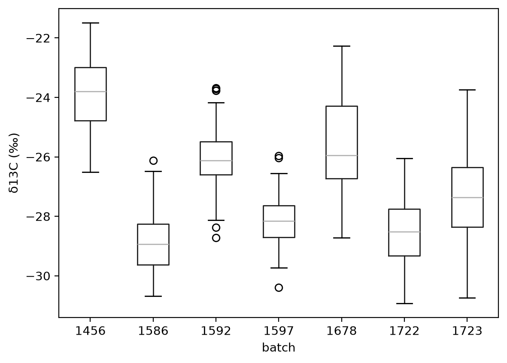
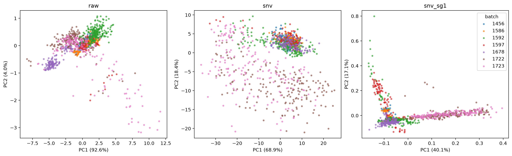
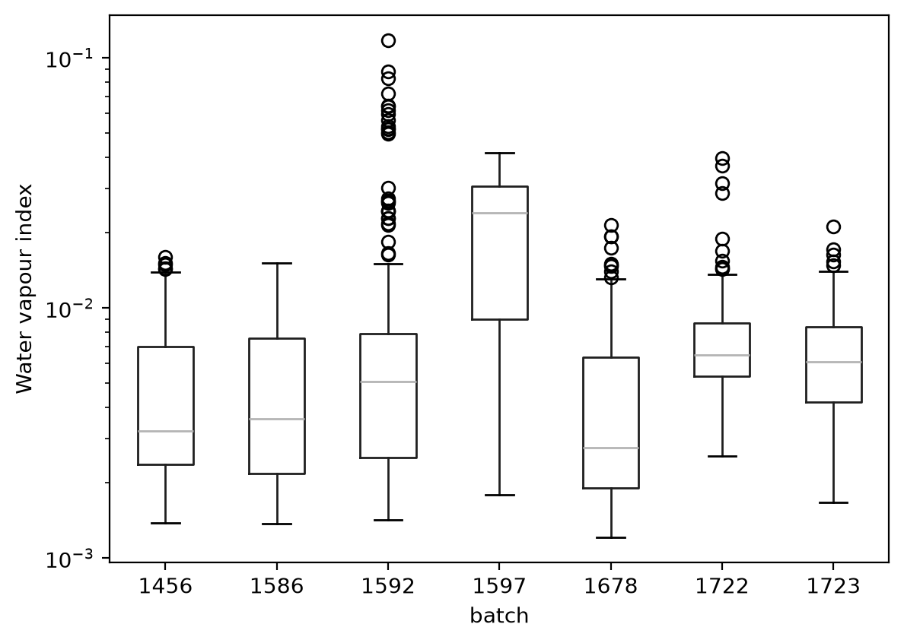
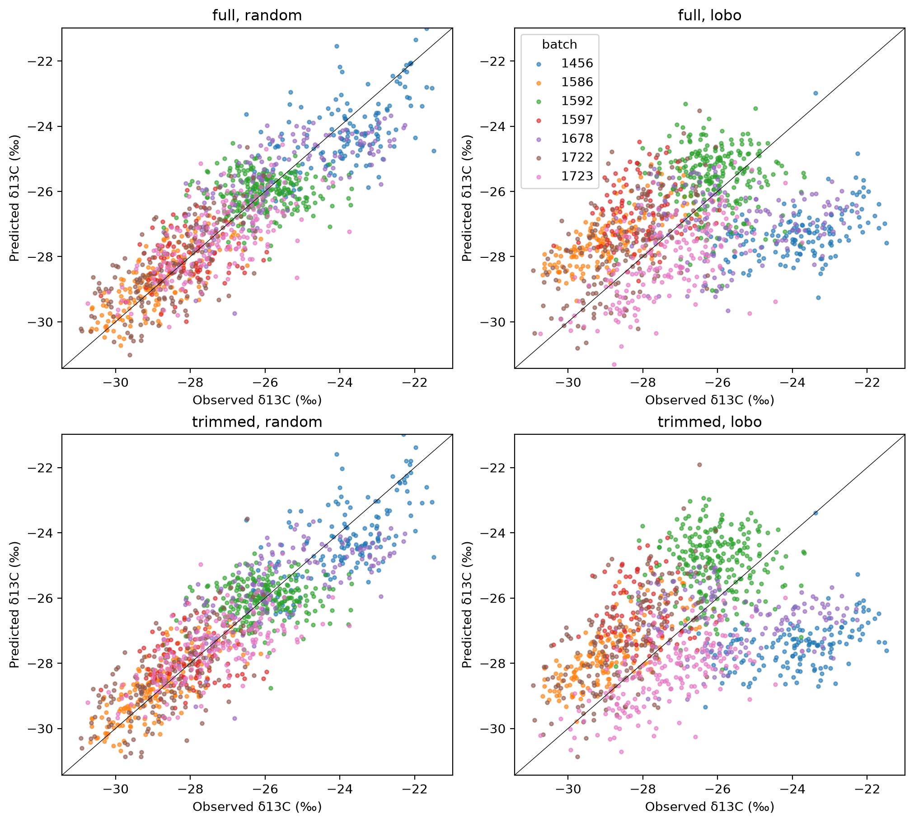

# Predicting δ13C from MIR spectra: findings

<!-- WARNING: THIS FILE WAS AUTOGENERATED! DO NOT EDIT! -->

**Work in progress.** The analysis isn’t finished. The findings below
come from a first round of models, and the growing conditions of the
batches are still missing. Expect the results and conclusions to change.

## Summary

A PLS model on the MIR spectra reaches an R² of 0.77 on a random split
stratified by batch. Batch identity alone reaches an R² of 0.68 on the
same data. The spectra add little to what the batch already tells us.

The model can’t predict the δ13C level of a batch it hasn’t seen. Under
leave-one-batch-out validation, its R² is -0.01.

Inside batches, the spectra carry real δ13C information. A local PLS
model, calibrated on samples from one batch, explains 36% to 73% of the
δ13C variation inside that batch. This holds for six of the seven
batches. Batch 1592 shows no signal.

MIRS can rank samples within a trial when some samples from that trial
have lab values. It can’t replace lab measurements for a new trial.

## Why δ13C

Cassava is a C3 plant. During photosynthesis, its carbon-fixing enzyme,
Rubisco, fixes CO2 that contains the light isotope 12C more readily than
CO2 that contains 13C. How strongly the leaf favours 12C depends on the
CO2 concentration inside the leaf, compared with the air outside.

A plant short of water closes its stomata to save water. The CO2
concentration inside the leaf then falls, and the leaf favours 12C less.
Its δ13C rises, which means it becomes less negative.

Leaf δ13C therefore records the balance between carbon gain and water
loss while the leaf grew. Plant scientists use it as a measure of
water-use efficiency and of a plant’s response to water stress. In
wheat, for example, breeders have used it to select varieties that use
water more efficiently.

Measuring δ13C needs isotope-ratio mass spectrometry, which is slow and
costly for each sample. MIR spectra are fast and cheap to collect. A
model that predicts δ13C from spectra would let breeders and
physiologists screen many more plants.

## Data

The spectra file `specs_trim.csv` holds absorbance spectra of 1184
samples. Each spectrum has 1711 points from 651.8 to 3949.5 cm⁻¹, about
1.93 cm⁻¹ apart. The file `all_batches_wet_chem.csv` holds δ13C values
for 1291 samples. 1158 samples appear in both files, and all the
analyses use these 1158 samples.

Sample ids have the form `<batch>_<sample>`. Each of the seven batches
is a set of plants grown under its own conditions and scanned at its own
time, on the same spectrometer. The data don’t record the conditions.

<table>
<thead>
<tr>
<th>Batch</th>
<th>Samples</th>
<th>Mean δ13C (‰)</th>
<th>Standard deviation (‰)</th>
</tr>
</thead>
<tbody>
<tr>
<td>1456</td>
<td>149</td>
<td>-23.85</td>
<td>1.20</td>
</tr>
<tr>
<td>1586</td>
<td>168</td>
<td>-28.87</td>
<td>1.00</td>
</tr>
<tr>
<td>1592</td>
<td>244</td>
<td>-26.06</td>
<td>0.85</td>
</tr>
<tr>
<td>1597</td>
<td>97</td>
<td>-28.11</td>
<td>0.78</td>
</tr>
<tr>
<td>1678</td>
<td>144</td>
<td>-25.56</td>
<td>1.62</td>
</tr>
<tr>
<td>1722</td>
<td>177</td>
<td>-28.54</td>
<td>1.11</td>
</tr>
<tr>
<td>1723</td>
<td>179</td>
<td>-27.36</td>
<td>1.26</td>
</tr>
</tbody>
</table>

δ13C by batch. The batch means differ by up to 5 ‰.

## Batch structure

Batch explains 68% of the δ13C variance. This is the between-batch share
of the variance (η²). The batch means span 5 ‰, from -28.87 ‰ in batch
1586 to -23.85 ‰ in batch 1456. Inside a batch, the standard deviation
is 0.78 to 1.62 ‰.

The spectra also differ between batches. In a PCA of the raw spectra,
the first component explains 92.6% of the variance. It reflects overall
absorbance and baseline, and it doesn’t correlate with δ13C (r = 0.00).
SNV removes this effect, and the separate cluster of batch 1678 in the
raw PCA disappears. After SNV and a Savitzky-Golay first derivative,
five batches overlap in one core. Batches 1722 and 1723 lie along a
separate arm. On the first component of these spectra, batch explains
80% of the variance (η² = 0.80). The arm comes from band shapes across
the fingerprint region, with the largest loading at 1250 cm⁻¹. Inside
batches 1722 and 1723, the position along the arm doesn’t follow δ13C (r
= -0.05 and 0.06).

The PCA plots and loadings are in the [EDA notebook](01_eda.ipynb).

First two PCA components of the raw spectra, the SNV spectra and the SNV
first-derivative spectra (`snv_sg1`), coloured by batch. In the
`snv_sg1` panel, the horizontal arm holds batches 1722 and 1723, and the
vertical arm holds samples with water vapour.

## Data quality: water vapour

Some spectra contain water vapour lines. These are sharp, regular lines
between about 3900 and 3550 cm⁻¹, with weaker ones between 1800 and 1300
cm⁻¹. They come from humidity in the beam path, not from the leaves.

We measured them with a water vapour index. The index takes each SNV
spectrum, subtracts a Savitzky-Golay smoothed copy (11-point window),
and returns the standard deviation of the residual between 3550 and 3900
cm⁻¹. It correlates with the second PCA component of the derivative
spectra at r = 0.92. That component is therefore water vapour, not leaf
chemistry.

<table>
<thead>
<tr>
<th>Batch</th>
<th>Samples above 3 times the median index</th>
<th>Share</th>
</tr>
</thead>
<tbody>
<tr>
<td>1456</td>
<td>0</td>
<td>0%</td>
</tr>
<tr>
<td>1586</td>
<td>0</td>
<td>0%</td>
</tr>
<tr>
<td>1592</td>
<td>27</td>
<td>11%</td>
</tr>
<tr>
<td>1597</td>
<td>57</td>
<td>59%</td>
</tr>
<tr>
<td>1678</td>
<td>4</td>
<td>3%</td>
</tr>
<tr>
<td>1722</td>
<td>6</td>
<td>3%</td>
</tr>
<tr>
<td>1723</td>
<td>2</td>
<td>1%</td>
</tr>
</tbody>
</table>

The threshold of 3 times the median is arbitrary. It shows how far the
problem spreads.

Four samples from batch 1722 stand apart in the PCA because of water
vapour: 1722_092, 1722_120, 1722_138 and 1722_147. Sample 1722_138 also
has a weaker band near 1250 cm⁻¹ than the rest of its batch.

Removing everything above 3550 cm⁻¹ changed the model results only
slightly. The lines between 1800 and 1300 cm⁻¹ are still in the spectra,
because trimming there would also remove the amide bands.

Water vapour index by batch, on a log scale. Batch 1597 has the highest
median.

## Validation

A random split puts samples from every batch into both training and test
folds. The model then learns where each batch sits, and the test score
rewards it for that. With 68% of the variance between batches, a random
split gives a high R² even when the spectra say little about δ13C
itself.

We used three scores:

- **Random split**, 5 folds stratified by batch. It tests predictions
  for new samples from batches the model has seen.
- **Leave one batch out**, 7 folds. It tests predictions for a batch the
  model has never seen.
- **Within-batch R²**. It centres the observed and predicted values on
  their batch means before computing R². A model that predicts only the
  batch means scores 0.

We also report the correlation r between observed and predicted values
inside each batch. It measures only the order of the predictions, and
ignores their level and spread. For ranking samples within a trial, r is
the score that matters.

The random-split R² splits into these parts. Batch explains 0.68 of the
variance. The remaining 0.32 lies inside batches, and the model explains
0.29 of it. Together, 0.68 + 0.29 × 0.32 = 0.77, which matches the
random-split R².

We recommend reporting the within-batch R² and the leave-one-batch-out
score next to any random-split R².

## Results

### Global PLS model

The pipeline applies SNV, a Savitzky-Golay first derivative (15-point
window, cubic polynomial) and PLS regression without feature scaling. We
chose the number of components by the lowest RMSE on the same folds that
score the model. This makes all scores below slightly optimistic.

<table>
<thead>
<tr>
<th>Split</th>
<th>Components</th>
<th>R²</th>
<th>RMSE (‰)</th>
<th>Within-batch R²</th>
</tr>
</thead>
<tbody>
<tr>
<td>Random</td>
<td>17</td>
<td>0.77</td>
<td>0.97</td>
<td>0.29</td>
</tr>
<tr>
<td>Leave one batch out</td>
<td>20</td>
<td>-0.01</td>
<td>2.01</td>
<td>-0.19</td>
</tr>
</tbody>
</table>

When a batch is left out, the model pulls its predictions towards the
mean of the other batches. Batch 1456 has the highest mean, and the
model predicts it 3.45 ‰ too low.

<table>
<thead>
<tr>
<th>Held-out batch</th>
<th>Bias (‰)</th>
<th>Within-batch R²</th>
<th>r</th>
</tr>
</thead>
<tbody>
<tr>
<td>1456</td>
<td>-3.45</td>
<td>0.13</td>
<td>0.42</td>
</tr>
<tr>
<td>1586</td>
<td>1.41</td>
<td>0.48</td>
<td>0.70</td>
</tr>
<tr>
<td>1592</td>
<td>0.45</td>
<td>-1.39</td>
<td>-0.03</td>
</tr>
<tr>
<td>1597</td>
<td>1.46</td>
<td>-1.08</td>
<td>0.12</td>
</tr>
<tr>
<td>1678</td>
<td>-1.38</td>
<td>-0.33</td>
<td>0.04</td>
</tr>
<tr>
<td>1722</td>
<td>0.90</td>
<td>-0.15</td>
<td>0.58</td>
</tr>
<tr>
<td>1723</td>
<td>-0.78</td>
<td>0.27</td>
<td>0.61</td>
</tr>
</tbody>
</table>

The model ranks four new batches moderately well, with r from 0.42 to
0.70. It has no ranking skill for batches 1592, 1597 and 1678. No number
of components between 3 and 20 gives consistent ranking on new batches.
For single batches, the within-batch R² changes sign as the number of
components changes. Removing the region above 3550 cm⁻¹ changes the
results only slightly.

Observed against predicted δ13C. The rows show the full and trimmed
spectra. The columns show the random split and leave-one-batch-out.
Under leave-one-batch-out, each batch’s predictions move towards the
mean of the other batches.

### Within-batch models

Two models learn only the variation inside batches. A local model is
fitted on one batch, with 5-fold cross-validation inside it. The pooled
model is fitted on all batches at once, after each batch is centred on
its own mean spectrum and mean δ13C. Each fold computes the batch means
from its training samples only. Both models need lab values from the
batch they predict.

<table style="width:100%;">
<colgroup>
<col style="width: 14%" />
<col style="width: 14%" />
<col style="width: 14%" />
<col style="width: 14%" />
<col style="width: 14%" />
<col style="width: 14%" />
<col style="width: 14%" />
</colgroup>
<thead>
<tr>
<th>Batch</th>
<th>Within-batch R², global</th>
<th>Within-batch R², local</th>
<th>Within-batch R², pooled</th>
<th>r, global</th>
<th>r, local</th>
<th>r, pooled</th>
</tr>
</thead>
<tbody>
<tr>
<td>1456</td>
<td>0.17</td>
<td>0.42</td>
<td>0.26</td>
<td>0.58</td>
<td>0.65</td>
<td>0.53</td>
</tr>
<tr>
<td>1586</td>
<td>0.57</td>
<td>0.73</td>
<td>0.66</td>
<td>0.77</td>
<td>0.86</td>
<td>0.81</td>
</tr>
<tr>
<td>1592</td>
<td>-0.35</td>
<td>0.00</td>
<td>-0.19</td>
<td>0.05</td>
<td>0.10</td>
<td>0.02</td>
</tr>
<tr>
<td>1597</td>
<td>-0.49</td>
<td>0.36</td>
<td>-0.13</td>
<td>0.25</td>
<td>0.66</td>
<td>0.33</td>
</tr>
<tr>
<td>1678</td>
<td>0.54</td>
<td>0.72</td>
<td>0.61</td>
<td>0.73</td>
<td>0.85</td>
<td>0.79</td>
</tr>
<tr>
<td>1722</td>
<td>0.30</td>
<td>0.62</td>
<td>0.51</td>
<td>0.69</td>
<td>0.79</td>
<td>0.77</td>
</tr>
<tr>
<td>1723</td>
<td>0.46</td>
<td>0.56</td>
<td>0.53</td>
<td>0.70</td>
<td>0.75</td>
<td>0.73</td>
</tr>
</tbody>
</table>

The global column is the random-split model. Local models do best in
every batch. They use 2 to 15 components. The pooled model uses 12
components and reaches an overall R² of 0.81, an RMSE of 0.87 ‰ and a
within-batch R² of 0.41.

Batch 1678 ranks well with its own local model (r = 0.85) and not at all
when left out of the global model (r = 0.04). Its relationship between
spectra and δ13C differs from the other batches. Batch 1597 shows the
same pattern, less strongly.

Batch 1592 shows no signal, even with its own local model. It has the
smallest δ13C spread of all batches, with a standard deviation of 0.85
‰. Measurement error in the lab values could account for much of that
spread.

The tables and plots are in the [PLS notebook](02_pls.ipynb).

## What this means for each use case

- **Ranking samples within a trial, with lab values for some of its
  samples.** This works. Local models reach r = 0.65 to 0.86 in six
  batches. The pooled model reaches r = 0.33 to 0.81 in the same six
  batches and needs fewer lab values per batch.
- **Ranking samples in a new trial with no lab values.** This works for
  some batches and fails for others. The data don’t show in advance
  which group a new batch falls into.
- **Predicting the δ13C level of a new trial.** This doesn’t work. The
  spectra don’t carry the batch level in a form that transfers.

## Open questions and next steps

1.  **Batch metadata.** The growing conditions, dates, genotypes and
    sample preparation of each batch could explain why 1678 and 1597
    differ from the rest, and why 1722 and 1723 form their own spectral
    group. If genotypes repeat across batches, we can test whether the
    spectra rank genotypes the same way across conditions.
2.  **Lab repeatability of δ13C.** This decides whether batch 1592 lacks
    signal or only lacks spread.
3.  **Water vapour correction.** Subtracting a reference vapour spectrum
    would also remove the lines between 1800 and 1300 cm⁻¹. If the
    instrument software kept the single-beam spectra, its atmospheric
    compensation may be cleaner.
4.  **Nested cross-validation.** Choosing the number of components in an
    inner loop gives unbiased scores.
5.  **Other models.** Memory-based learning or Cubist are worth a
    bounded test after steps 1 to 4. They must beat PLS on the
    within-batch scores and on leave-one-batch-out ranking, not on the
    random split.

## Methods

- [00_data](00_data.ipynb) loads and aligns the two files.
- [01_eda](01_eda.ipynb) covers δ13C by batch, the PCA, the loadings and
  the water vapour index.
- [02_pls](02_pls.ipynb) covers the global, local and pooled PLS models.

The random split uses
`StratifiedKFold(5, shuffle=True, random_state=0)`, stratified by batch.
The local models use `KFold(5, shuffle=True, random_state=0)` inside
each batch. Leave-one-batch-out uses `LeaveOneGroupOut`. All models use
`soilspectfm` preprocessing and scikit-learn
`PLSRegression(scale=False)`. The data files are not part of the
repository.
